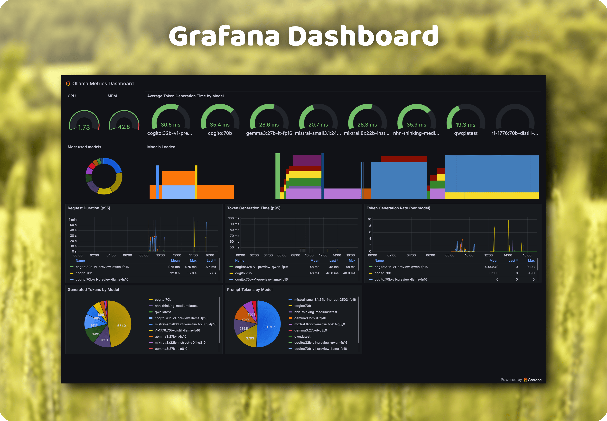

# Ollama Metrics Sidecar

A lightweight metrics collector and proxy for [Ollama](https://ollama.com/) that exposes Prometheus metrics for monitoring your LLM deployments.


## Overview

Ollama Metrics Sidecar sits between your applications and Ollama, collecting metrics on:

- Token usage (prompt and generated tokens)
- Request duration
- Inference speed (time per token)
- Model memory usage
- Model loading status

It acts as a transparent proxy, forwarding all requests to Ollama while collecting metrics without affecting normal operation.

## Features

- Zero configuration required - works out of the box
- No modification to Ollama needed
- Collects detailed metrics on model usage and performance
- Prometheus compatible metrics endpoint
- Comes with pre-built Grafana dashboard

## Usage

### Environment Variables

- `OLLAMA_HOST` - Ollama host address (default: `http://localhost:11434`)
- `PORT` - Port to run the metrics server on (default: `8080`)

### Docker

```bash
docker run -d --name ollama-metrics \
  -e OLLAMA_HOST=http://ollama:11434 \
  -p 8080:8080 \
  ghcr.io/norskhelsenett/ollama-metrics:latest
```

### Local Development

```bash
# Run directly
go run main.go

# Build and run
go build -o ollama-metrics
./ollama-metrics
```

## Metrics

Access Prometheus metrics at http://localhost:8080/metrics

### Available Metrics

- `ollama_prompt_tokens_total` - Total number of prompt tokens sent to the model
- `ollama_generated_tokens_total` - Total number of tokens generated by the model
- `ollama_requests_total` - Total number of proxied requests by endpoint, model, and status
- `ollama_request_errors_total` - Total number of proxied requests returning HTTP 4xx or 5xx
- `ollama_request_duration_seconds` - Duration of Ollama requests in seconds
- `ollama_time_per_token_seconds` - Time per generated token (seconds per token)
- `ollama_prompt_eval_duration_seconds` - Duration spent evaluating prompt tokens
- `ollama_eval_duration_seconds` - Duration spent generating completion tokens
- `ollama_load_duration_seconds` - Duration spent loading the model
- `ollama_total_duration_seconds` - Total duration reported by Ollama
- `ollama_generated_tokens_per_second` - Generated token throughput based on Ollama eval duration
- `ollama_loaded_models` - Number of models currently loaded in memory
- `ollama_model_loaded` - Indicator (1/0) if a model is loaded
- `ollama_model_ram_mb` - RAM usage in MB for each loaded model
- `ollama_model_vram_mb` - VRAM usage in MB for each loaded model

## Prometheus & Grafana Setup

A pre-configured Prometheus and Grafana setup is available in the `prometheus/` directory:

```bash
cd prometheus
docker-compose up -d
```

This will start:
- Prometheus for metrics collection
- Grafana with pre-configured dashboard

Access Grafana at http://localhost:3000 (default credentials: admin/admin)

## Building from Source

```bash
# Clone the repository
git clone https://github.com/NorskHelsenett/ollama-metrics.git
cd ollama-metrics

# Build
docker build -t ollama-metrics .

# Or build locally
go build -o ollama-metrics
```

## Screenshots



## License

[MIT License](LICENSE)

## Contributing

Contributions welcome! Please feel free to submit a Pull Request.
